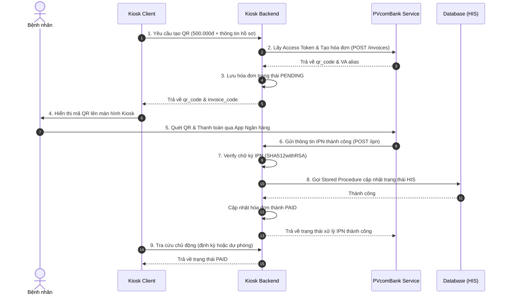

# Hướng Dẫn Các Bước Thanh Toán Viện Phí 500.000đ Qua VietQR

Tài liệu này hướng dẫn chi tiết luồng tích hợp và các bước gọi API khi thực hiện thanh toán viện phí trị giá **500.000 VNĐ** tại Kiosk qua dịch vụ thu hộ VietQR (PVcomBank).

---

## Luồng Nghiệp Vụ Tổng Quan



---

## Các Bước Triển Khai Chi Tiết (Ví dụ 500.000đ)

### Bước 1: Kiosk yêu cầu tạo hóa đơn thanh toán VietQR
Khi bệnh nhân chọn thanh toán trên Kiosk với số tiền 500.000 VNĐ, Kiosk client sẽ gửi request tới Kiosk Backend.

*   **Endpoint:** `POST /api/v1/vietqr/invoices`
*   **Headers:** `Authorization: Bearer <Kiosk_JWT_Token>`
*   **Request Body (JSON):**
```json
{
  "amount": "500000",
  "description": "Thanh toan vien phi Ho so HS001928",
  "paymentType": "CONGKHAM",
  "maHoSo": "HS001928",
  "maNb": "NB992837",
  "maThietBi": "KIOSK-01",
  "tenThuNgan": "Kiosk Tự Động",
  "maPOS": "POS-01",
  "phieuThuId": "PT8827361",
  "checksum": "abc123xyz",
  "invoiceExpirySeconds": 300
}
```

*   **Response nhận được từ Backend (JSON):**
```json
{
  "statusCode": "00",
  "message": "SUCCESS",
  "data": {
    "invoice_code": "INV16870712345670123",
    "status": "PENDING",
    "amount": "500000",
    "currency": "VND",
    "alias": "99901234567890123",
    "invoice_expiry_time": "2026-06-18T14:08:46+07:00",
    "payment_method": "bank_transfer",
    "next_action": {
      "type": "qr_code",
      "qr_code": "00020101021238570010A000000727012700069704220113099012345678900208QRIBFTTA53037045802VN5915Cong ty TNHH ABC6005Hanoi62200816INV168707123456701236304ABCD"
    }
  }
}
```

### Bước 2: Hiển thị mã QR và Bệnh nhân thanh toán
1.  Kiosk Client lấy chuỗi `qr_code` ở trên và vẽ (render) ra định dạng ảnh QR Code.
2.  Bệnh nhân mở ứng dụng Mobile Banking của ngân hàng bất kỳ, chọn **Quét mã QR**.
3.  Thông tin số tiền (500.000 VNĐ), ngân hàng thụ hưởng (PVcomBank) và nội dung chuyển khoản (`INV16870712345670123`) sẽ tự động được điền.
4.  Bệnh nhân xác thực vân tay/OTP để chuyển khoản.

### Bước 3: Nhận thông báo IPN từ PVcomBank
Sau khi tiền được ghi có vào tài khoản ngân hàng, PVcomBank sẽ thực hiện gọi webhook (IPN) về hệ thống Kiosk Backend.

*   **Endpoint:** `POST /api/v1/vietqr/ipn` (Đã được cấu hình mở public bypass JWT filter)
*   **Request Body từ PVcomBank (JSON):**
```json
{
  "data": {
    "account": "103000817212",
    "va": "99901234567890123",
    "currency": "VND",
    "amount": "500000",
    "tranDate": "2026-06-18 14:04:12.123456",
    "tranId": "FT26170982372",
    "description": "INV16870712345670123"
  },
  "signature": "MIAGCSqGSIb3DQEHAqCAMIACAQExDzANBglghkgBZQMEAgEFADCABgkqhkiG9w0BBwGggCSAB..."
}
```

*   **Logic xử lý tại Backend:**
    1.  Tạo chuỗi xác thực chữ ký: `tranId + account + currency + amount + tranDate + description`
        `FT26170982372103000817212VND5000002026-06-18 14:04:12.123456INV16870712345670123`
    2.  Verify chữ ký `signature` sử dụng Public Key của PVcomBank bằng thuật toán `SHA512withRSA`.
    3.  Lấy thông tin hóa đơn lưu tạm trong cơ sở dữ liệu `vietqr_invoices` dựa trên `invoiceCode = description` (`INV16870712345670123`).
    4.  Cập nhật trạng thái hóa đơn cục bộ sang `PAID`.
    5.  Thực thi stored procedure HIS `KIOS_CAPNHATTHANHTOAN_CONGKHAM` (do `paymentType` lúc tạo là `CONGKHAM`):
        ```sql
        EXEC KIOS_CAPNHATTHANHTOAN_CONGKHAM 
            @maHoSo = 'HS001928',
            @maNb = 'NB992837',
            @maGiaoDich = 'FT26170982372',
            @thoiGianThanhToanUTC = '2026-06-18 14:04:12.123456',
            @trangThaiThanhToan = '1',
            @hinhThucThanhToan = 'viet_qr',
            @maThietBi = 'KIOSK-01',
            @tenThuNgan = 'Kiosk Tự Động',
            @maPOS = 'POS-01',
            @soTien = '500000',
            @phieuThuId = 'PT8827361',
            @checksum = 'abc123xyz'
        ```
    6.  Trả về kết quả xác thực cho PVcomBank.

*   **Response trả về cho PVcomBank (JSON):**
```json
{
  "data": {
    "orderId": "INV16870712345670123",
    "status": "processed"
  },
  "verify_signature": "true"
}
```

### Bước 4: Kiểm tra trạng thái chủ động (Truy vấn giao dịch)
Nếu vì lý do mạng hoặc lỗi đường truyền IPN không tới được, Kiosk có thể chủ động kiểm tra trạng thái thanh toán bằng cách gửi yêu cầu GET:

*   **Endpoint:** `GET /api/v1/vietqr/invoices/INV16870712345670123`
*   **Response trả về (JSON):**
```json
{
  "statusCode": "00",
  "message": "SUCCESS",
  "data": {
    "account": "103000817212",
    "currency": "VND",
    "amount": "500000",
    "tranDate": "2026-06-18 14:04:12.123456",
    "tranId": "FT26170982372",
    "description": "INV16870712345670123"
  }
}
```
*(Nếu giao dịch thành công tại ngân hàng nhưng trạng thái ở database local vẫn là PENDING, khi thực hiện query này hệ thống cũng sẽ đồng thời cập nhật và đồng bộ thanh toán vào HIS).*

---

## Cấu Hình Bổ Sung

### 1. Đọc khóa công khai (Public Key) từ file `.pem`
Hệ thống hỗ trợ cấu hình đọc Public Key của PVcomBank từ file PEM. Trong file `application-payment.yml`, bạn có thể chỉ định đường dẫn như sau:
```yaml
vietqr:
  pvcombank:
    security:
      # Bạn có thể trỏ tới file PEM trong classpath hoặc file vật lý
      pvcombank-public-key: classpath:pvcombank_public_key.pem
```
Bạn chỉ cần tạo file `pvcombank_public_key.pem` trong thư mục `src/main/resources/` chứa nội dung khóa công khai PEM chuẩn (có hoặc không có dòng đầu/cuối `-----BEGIN/END PUBLIC KEY-----`).

### 2. Script khởi tạo bảng Cơ sở dữ liệu (SQL Server)
Do cấu hình `ddl-auto` được thiết lập là `none` trên cơ sở dữ liệu `dakhoa_backup`, bạn cần chạy đoạn script SQL sau trong SQL Server để khởi tạo bảng `vietqr_invoices`:

```sql
-- Chạy script này trên cơ sở dữ liệu dakhoa_backup để tạo bảng lưu trữ giao dịch VietQR
IF NOT EXISTS (SELECT * FROM sysobjects WHERE name='vietqr_invoices' AND xtype='U')
BEGIN
    CREATE TABLE vietqr_invoices (
        invoice_code NVARCHAR(50) NOT NULL PRIMARY KEY,
        amount NVARCHAR(50) NOT NULL,
        currency NVARCHAR(3),
        description NVARCHAR(255),
        status NVARCHAR(20),
        alias NVARCHAR(50),
        qr_code NVARCHAR(1000),
        expiry_time DATETIME2,
        created_at DATETIME2,
        updated_at DATETIME2,
        payment_type NVARCHAR(20),
        ma_ho_so NVARCHAR(50),
        ma_nb NVARCHAR(50),
        ma_thiet_bi NVARCHAR(50),
        ten_thu_ngan NVARCHAR(100),
        ma_pos NVARCHAR(50),
        phieu_thu_id NVARCHAR(50),
        checksum NVARCHAR(255),
        ct_details_json NVARCHAR(MAX)
    );
END;
GO
```

